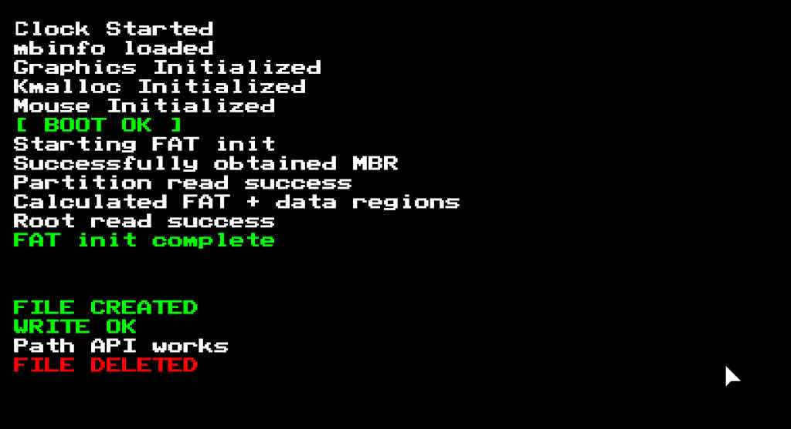

```text
Hello!
This is albe here to explain how to build/run the OS
** PLEASE NOTE THAT I'VE JUST UNDERGONE A HUGE MIGRATION
FROM VEGA TO VIDEO GRAPHICS.... SEE changelog.txt FOR 
THE FULL UPDATE, BUT ITS VERY MESSY RIGHT NOW **

Step 1.
Download AlbeOS and unzip it.
Step 2. Download the following dependencies:

UBUNTU:
1. Linux ELF tools [i686-elf-gcc] (download and move them into this Folder)
2. cc-multilib make bison flex libgmp3-dev libmpc-dev libmpfr-dev texinfo
2. qemu-system-x86
3. grub
4. xorriso
5. mtools
6. dosfstools

ARCH:
1. gcc
2. VNC Viewer (any)
2. qemu-system-x86
3. grub
4. xorriso
5. mtools
6. dosfstools

**NOTE**
If youre using Ubuntu, enter the ./build.sh file in a text editor
and uncomment and comment a few lines... it tells you which ones
inside the file
Also, I've yet to test the GFX update in ubuntu, so idk if the
build works...

Step 3. CD into albeos-main (current dir) and run 
$ sudo ./build.sh
(it HAS to be sudo otherwise the disk partitioning will NOT WORK!)
It should look like this:

$ cd Desktop/albeos-main
$ sudo ./build.sh
$ ls
AlbeOS.iso  build.sh       dependencies  iso       linker.ld
boot.s      changelog.txt  disk.img      kernel.c  README

Step 4. run the updated qemu command from inside the directory
(the build script gives you it)
EX: qemu-system-x86_64 -cdrom AlbeOS.iso -vga std -drive file=disk.img,format=raw 

NOTE:
If youre using arch linux, add '-vnc 127.0.0.1:0' at the end
of the qemu command and then open a VNC viewer and set the
output to 127.0.0.1:5900
You may not have to, but im using Hyprland and for some reason
qemu just REALLY didn't want to open a window for me, so this
was my quick-hacky workaround.

```
